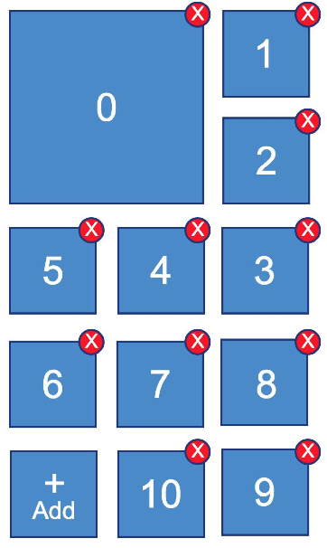

# Problem Description:
The   JSON   contains   an   array   of   items   which   you   have   to   display   on   the   screen.   Each   item has   an   identifier   ( uuid )   and   a   link   to   the   picture   ( imageUrlString ).   You   can   use   your   own links   if   you   don’t   like   our   images   :)
After   parsing   you   should   display   these   items   on   the   screen   like this:

The   numbers   in   the   boxes   explain   the   order   of the   items   visible   on   the   screen.   You   don’t need   to   place   these   numbers,   it’s   just   an explanation.   Each   box   should   instead   contain an    image    (downloaded   from    imageUrlString ) and   should   have   a    button   to   remove   the item.    The   zero   box   is   always   bigger   than   the rest   of   the   boxes.
The   last   box   does   not   represent   an   item   - instead   it   has   the   button   to   add   a   new   one. After   pressing   the   button   the   user   should   see a   dialog   with   a   text   field   where   he   can   insert   a new   link   -   and   create   a   new   item   by   selecting “OK”   or   cancel   the   process   by   selecting “Cancel”.   You   must   generate   the   identifier   by yourself.   Next   update   the   JSON   and   add   a new   box   to   the   screen.
For   example:   You   have   11   items   and   add   a new   item.   The   new   item   will   have   the    index   11 and   the   new   box   will   be   added   instead   of
“ Add ”.   “ Add ”   will   move   underneath   the   new   box,   to   the    12th    position.   All   further   boxes should   respect   the   same   layout   rule   of   the   shown   diagram   (like   the   snake   path   :)   If   items take   more   than   the   screen   height,   the   view   should   become   vertically   scrollable.
Tapping   the    delete    button   should   erase   the   item   in   the   number   sequence,   deleting   in   both the   view   as   well   as   the   JSON.   Before   the   action,   the   confirmation   dialog   should   be   shown   to user.   The   text   should   read:    “Do   you   really   want   to   delete   the   item     with   identifier    UUID ?” (Replace   the   word   “UUID”   with   the   real   item   identifier).   If   the   user   selects   “Yes”   then   delete the   item,   if   he   selects   “Cancel”   -   nothing   happens,   just   close   the   dialog.
For   example:   When   clicking   the   “Delete”   button   on   the   box   7   in   the   number   sequence,   all   of the   following   box   (8,   9,   10   etc.)   should   change   their   position   according   to   box   7‘s   deletion, leaving   no   empty   boxes.
After    selecting   a   box    by   tapping   on   it,   the   user   should   see   a   message  “   You   have   selected the   item   with   identifier    UUID ”    Again,   replace   the   “UUID”   with   the   real   identifier   of   the   item.
The   user   should   be   able   to    reorder   the   items    with   drag   and   drop,   each   reorder   operation should   affect   the   JSON   as   well.   Please   pay   attention   that   the   zero   index   box   should   always be   bigger   than   the   others.
All   view   modifications   should   perform   in   an   animated   way.

Technologies involved

- [Layered Architecture Pattern][1] ([Clean Architecture][2])
- [Reactive Programming][9] with [RxJava][8]
- [Dependency Injection][3] with [Dagger 2][4]
- Android View [Binding][17] with [Butterknife][5]
- [Repository Pattern][6]
- [HTTP Client API][7]
- [Unit Test][10] following [TDD First][11] approach ([JUnit][12])
- [Testing UI][14] with [Espresso][14] ([black-box testing][15])
[1]: https://www.oreilly.com/ideas/software-architecture-patterns/page/2/layered-architecture
[2]: https://8thlight.com/blog/uncle-bob/2012/08/13/the-clean-architecture.html
[3]: https://martinfowler.com/articles/injection.html
[4]: https://google.github.io/dagger/
[5]: http://jakewharton.github.io/butterknife/
[6]: https://msdn.microsoft.com/en-us/library/ff649690.aspx
[7]: https://square.github.io/retrofit/
[8]: https://github.com/ReactiveX/RxJava
[9]: https://medium.com/@kuassivi/functional-reactive-programming-with-rxjava-part-2-78db194e7d35#.7mx0stygm
[10]: https://developer.android.com/training/testing/unit-testing/index.html
[11]: https://www.versionone.com/agile-101/agile-software-programming-best-practices/test-first-programming/
[12]: http://junit.org/junit4/
[13]: https://developer.android.com/training/testing/unit-testing/local-unit-tests.html
[14]: https://google.github.io/android-testing-support-library/docs/espresso/
[15]: http://www.guru99.com/black-box-testing.html
[16]: http://reactivex.io/documentation/operators.html
[17]: http://softwareengineering.stackexchange.com/questions/200115/what-is-early-and-late-binding

